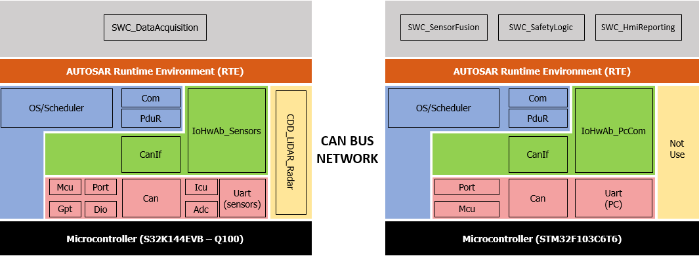
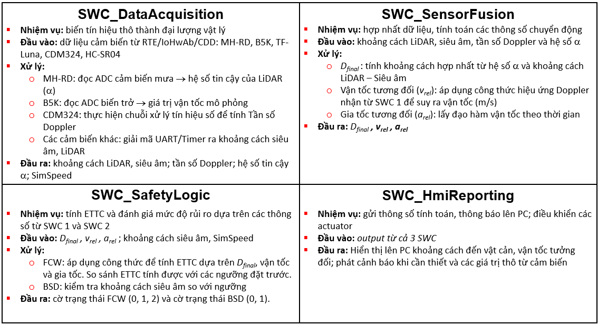
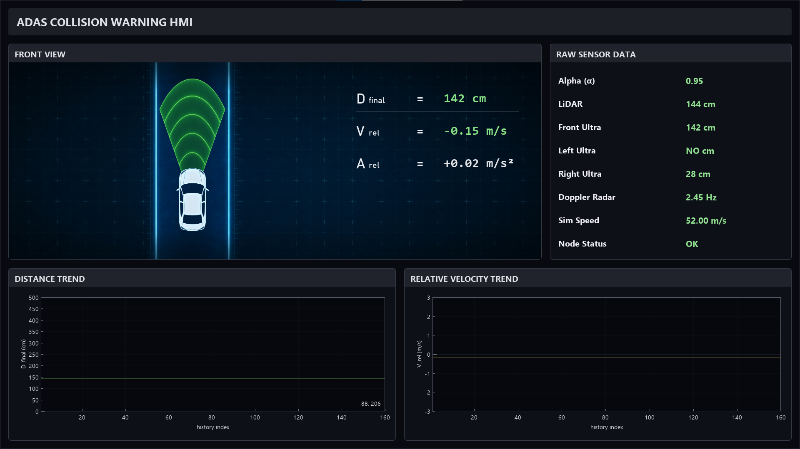

# AUTOSAR Collision Warning System

> **Đồ án tốt nghiệp** — Hệ thống ADAS cảnh báo va chạm sớm thời gian thực sử dụng thuật toán **Sensor Fusion** giữa Radar, LiDAR và Ultrasonic, triển khai trên kiến trúc **AUTOSAR** với mạng truyền thông **CAN Bus**.

---

## Mục lục

- [Giới thiệu](#-giới-thiệu)
- [Kiến trúc hệ thống](#-kiến-trúc-hệ-thống)
- [Kiến trúc phần mềm AUTOSAR](#-kiến-trúc-phần-mềm-autosar)
- [Software Components (SWC)](#-software-components-swc)
- [Giao diện HMI](#-giao-diện-hmi)
- [Phần cứng sử dụng](#-phần-cứng-sử-dụng)
- [Cấu trúc thư mục](#-cấu-trúc-thư-mục)
- [Hướng dẫn build & flash](#-hướng-dẫn-build--flash)

---

## Giới thiệu

Dự án xây dựng hệ thống **ADAS (Advanced Driver Assistance System)** cảnh báo va chạm sớm với các tính năng:

- **FCW (Forward Collision Warning):** Cảnh báo nguy cơ va chạm phía trước dựa trên khoảng cách và vận tốc tương đối
- **BSD (Blind Spot Detection):** Phát hiện vật thể trong điểm mù hai bên xe
- **Sensor Fusion:** Kết hợp dữ liệu từ LiDAR, Radar Doppler và Ultrasonic để tăng độ chính xác
- **Real-time processing:** Xử lý tín hiệu và cảnh báo theo thời gian thực trên kiến trúc AUTOSAR

---

## Kiến trúc hệ thống


Hệ thống gồm hai node chính giao tiếp qua **CAN Bus** thông qua transceiver **MCP2551**:

| Node | Vi điều khiển | Vai trò |
|------|--------------|---------|
| **Sensing Node** | NXP S32K144EVB – Q100 | Thu thập dữ liệu từ tất cả các cảm biến |
| **Control Node** | STM32F103C6T6 | Sensor Fusion, Safety Logic, HMI Reporting |

**Cảm biến tích hợp:**

| Cảm biến | Model | Giao tiếp | Thông số đo |
|----------|-------|-----------|-------------|
| LiDAR | TF-Luna | UART | Khoảng cách phía trước |
| Radar Doppler | CDM324 | ADC | Tần số Doppler → vận tốc |
| Ultrasonic (Front) | HC-SR04 | GPIO/Timer | Hỗ trợ LiDAR cho khoảng cách trước |
| Ultrasonic (Side) | HC-SR04 | GPIO/Timer | Phát hiện điểm mù 2 bên phía sau |
| Biến trở | B5K | ADC | Giả lập vận tốc xe |
| Cảm biến mưa | MH-RD | ADC | Trạng thái môi trước → hệ số tin cậy LiDAR (alpha) |

---

## Kiến trúc phần mềm AUTOSAR



Dự án tuân theo mô hình phân lớp của **AUTOSAR Classic Platform**:

**Sensing Node (S32K144):**
- `SWC_DataAcquisition` — Application Layer
- `IoHwAb_Sensors`, `CanIf`, `Com`, `PduR`, `Os`, `Port`, `Dio`, `Gpt`, `Can`, `Adc`, `Uart`, `Icu`, `Mcu` — BSW Layers
- Runtime Environment (RTE)

**Control Node (STM32F103):**
- `SWC_SensorFusion`, `SWC_SafetyLogic`, `SWC_HmiReporting` — Application Layer
- `IoHwAb_PcCom`, `CanIf`, `Com`, `PduR`, `Os`, `Port`, `Mcu`, `Uart`, `Can` — BSW Layers
- Runtime Environment (RTE)

---

## Software Components (SWC)



---

## Giao diện HMI



Giao diện desktop được xây dựng bằng **Python (PyQt5 / Matplotlib)**, hiển thị real-time:

- **Front View:** Mô phỏng góc nhìn phía trên với cảnh báo trực quan
- **D_final / V_rel / A_rel:** Khoảng cách, vận tốc và gia tốc tương đối
- **Raw Sensor Data:** Giá trị thô từng cảm biến
- **Distance Trend / Velocity Trend:** Biểu đồ theo thời gian thực

---

## Phần cứng sử dụng

| Thành phần | Model |
|-----------|-------|
| Sensing MCU | NXP S32K144EVB-Q100 |
| Control MCU | STM32F103C6T6 |
| CAN Transceiver | MCP2551 |
| LiDAR | Benewake TF-Luna |
| Radar | CDM324 |
| Ultrasonic | HC-SR04 |
| Rain Sensor | MH-RD |
| Biến trở | B5K |

---

## Cấu trúc thư mục

```
AUTOSAR_Collision-Warning-System/
├── SENSING_NODE_S32K/          # Firmware cho NXP S32K144 (Sensing Node)
│   ├── src/
│   │   ├── App
│   │   ├── CDD
│   │   ├── ECU Abs
│   │   └── ...
│   ├── include/
│   └── Debug_FLASH
│
├── CONTROL_NODE_STM32/         # Firmware cho STM32F103 (Control Node)
│   ├── core/
│   │   ├── Inc/
│   │   ├── Src/
│   │   ├── Startup
│   ├── Drivers
│   └── Debug
│
├── HMI/                        # Giao diện PC (Python)
│   ├── hmi_dpg.py
│   └── hmi_assets/
│
├── References/                 # Tài liệu tham khảo, datasheet
└── README.md
```

---

## Hướng dẫn build & flash

### Yêu cầu công cụ

- **S32 Design Studio** (cho S32K144)
- **STM32CubeIDE** (cho STM32F103)
- **Python 3.8+** với các thư viện: `pyserial`, `matplotlib`, `PyQt5`

### Build firmware

```bash
# Sensing Node (S32K144)
cd SENSING_NODE_S32K
make all

# Control Node (STM32F103)
cd CONTROL_NODE_STM32
make all
```

### Flash firmware

```bash
# S32K144 — dùng J-Link hoặc OpenSDA
JLinkExe -device S32K144 -if SWD -speed 4000 -CommandFile flash_s32k.jlink

# STM32F103 — dùng ST-Link
st-flash write CONTROL_NODE_STM32/build/output.bin 0x08000000
```

### Chạy HMI

```bash
cd HMI
pip install -r requirements.txt
python main.py --port COMx --baud 115200   # Windows
python main.py --port /dev/ttyUSBx         # Linux
```

---

## Kết quả thực nghiệm

| Thông số | Giá trị |
|---------|---------|
| Chu kỳ xử lý CAN | ~10 ms |
| Độ trễ cảnh báo FCW | < 50 ms |
| Sai số D_final (so với LiDAR) | < 5 cm |
| Tốc độ cập nhật HMI | ~10 FPS |
| Tầm phát hiện LiDAR | 0.2 – 8 m |
| Tầm phát hiện Radar | 0.5 – 15 m |

---
