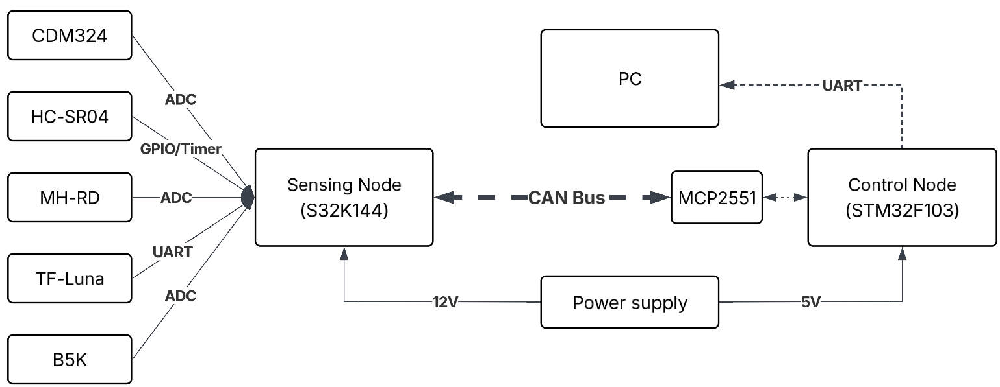

# AUTOSAR Collision Warning System

> **Đồ án tốt nghiệp** — Hệ thống ADAS cảnh báo va chạm sớm thời gian thực sử dụng thuật toán **Sensor Fusion** giữa Radar, LiDAR và Ultrasonic, triển khai trên kiến trúc **AUTOSAR** với mạng truyền thông **CAN Bus**.

---

## Mục lục

- Giới thiệu
- Kiến trúc hệ thống
- Kiến trúc phần mềm AUTOSAR
- Software Components
- Giao diện HMI
- Phần cứng sử dụng
- Cấu trúc thư mục
- Hướng dẫn cài đặt
- Kết quả
- Tác giả

---

## Giới thiệu

Dự án xây dựng hệ thống **ADAS (Advanced Driver Assistance System)** cảnh báo va chạm sớm với các tính năng:

- **FCW (Forward Collision Warning):** Cảnh báo nguy cơ va chạm phía trước dựa trên ETTC - sử dụng khoảng cách, vận tốc và gia tốc tương đối
- **BSD (Blind Spot Detection):** Cảnh báo khi khoảng cách bị thu hẹp hoặc có sự biến thiên đáng kể trong vùng quét
- **Sensor Fusion:** Kết hợp dữ liệu từ LiDAR, Radar Doppler và Ultrasonic để tăng độ chính xác
- **Real-time processing:** Xử lý tín hiệu và cảnh báo theo thời gian thực trên kiến trúc AUTOSAR

---

## Kiến trúc hệ thống



Hệ thống gồm hai node chính giao tiếp qua **CAN Bus** thông qua transceiver **MCP2551**:

| Node | Vi điều khiển | Vai trò |
|------|--------------|---------|
| **Sensing Node** | NXP S32K144EVB – Q100 | Thu thập dữ liệu từ tất cả các cảm biến |
| **Control Node** | STM32F103C6T6 | Sensor Fusion, Safety Logic, HMI Reporting |

**Cảm biến tích hợp:**

| Cảm biến | Model | Giao tiếp | Thông số đo |
|----------|-------|-----------|-------------|
| LiDAR | TF-Luna | UART | Khoảng cách phía trước |
| Radar Doppler | CDM324 | ADC | Tần số Doppler → vận tốc |
| Ultrasonic (Front) | HC-SR04 | GPIO/Timer | Hỗ trợ LiDAR cho khoảng cách trước |
| Ultrasonic (Side) | HC-SR04 | GPIO/Timer | Phát hiện điểm mù 2 bên phía sau |
| Biến trở | B5K | ADC | Giả lập vận tốc xe |
| Cảm biến mưa | MH-RD | ADC | Trạng thái môi trước → hệ số tin cậy LiDAR (alpha) |

---

## Kiến trúc phần mềm AUTOSAR


Dự án tuân theo mô hình phân lớp của **AUTOSAR Classic Platform**:

**Sensing Node (S32K144):**
- `SWC_DataAcquisition` — Application Layer
- `IoHwAb_Sensors`, `CDD_LiDAR_Radar`, `CanIf`, `Com`, `PduR`, `Os`, `Port`, `Dio`, `Gpt`, `Can`, `Adc`, `Uart`, `Icu`, `Mcu` — BSW Layers
- Runtime Environment (RTE)

**Control Node (STM32F103):**
- `SWC_SensorFusion`, `SWC_SafetyLogic`, `SWC_HmiReporting` — Application Layer
- `IoHwAb_PcCom`, `CanIf`, `Com`, `PduR`, `Os`, `Port`, `Mcu`, `Uart`, `Can` — BSW Layers
- Runtime Environment (RTE)

---

## Software Components (SWC)


---

## Giao diện HMI


HMI được phát triển bằng ngôn ngữ Python 3.8+ với thư viện DearPyGUI, mang lại hiệu suất hiển thị vượt trội nhờ render bằng GPU:

- **Front View:** Mô phỏng góc nhìn phía trên với cảnh báo trực quan
- **D_final / V_rel / A_rel:** Khoảng cách, vận tốc và gia tốc tương đối
- **Raw Sensor Data:** Giá trị thô từng cảm biến
- **Distance Trend / Velocity Trend:** Biểu đồ theo thời gian thực

---

## Phần cứng sử dụng

| Thành phần | Model |
|-----------|-------|
| Sensing MCU | NXP S32K144EVB-Q100 |
| Control MCU | STM32F103C6T6 |
| CAN Transceiver | MCP2551 |
| LiDAR | Benewake TF-Luna |
| Radar | CDM324 |
| Ultrasonic | HC-SR04 |
| Rain Sensor | MH-RD |
| Biến trở | B5K |

---

## Cấu trúc thư mục

```
AUTOSAR_Collision-Warning-System/
├── SENSING_NODE_S32K/          # Firmware cho NXP S32K144 (Sensing Node)
│   ├── src/
│   │   ├── App
│   │   ├── CDD
│   │   ├── ECU Abs
│   │   └── ...
│   ├── include/
│   └── Debug_FLASH
│
├── CONTROL_NODE_STM32/         # Firmware cho STM32F103 (Control Node)
│   ├── core/
│   │   ├── Inc/
│   │   ├── Src/
│   │   ├── Startup
│   ├── Drivers
│   └── Debug
│
├── HMI/                        # Giao diện PC (Python)
│   ├── hmi_dpg.py
│   └── hmi_assets/
│
├── References/                 # Tài liệu tham khảo, datasheet
└── README.md
```

---

## Hướng dẫn cài đặt

### Phần mềm cần cài đặt

- [S32 Design Studio for S32 Platform](https://www.nxp.com/design/software/development-software/s32-design-studio-ide/s32-design-studio-for-s32-platform:S32DS-S32PLATFORM)
- [STM32CubeIDE](https://www.st.com/en/development-tools/stm32cubeide.html)
- Python 3.8+

### Driver cần thiết

- OpenSDA / J-Link Driver (cho S32K144EVB)
- ST-Link Driver (cho STM32F103)

---

### Cài đặt Sensing Node (S32K144)

#### Bước 1 — Import project vào S32DS

```
File → Import → Existing Projects into Workspace
```

Chọn thư mục `SENSING_NODE_S32K`.

#### Bước 2 — Tải CMSIS-DSP

Tải và giải nén về máy:
- [CMSIS-DSP](https://github.com/ARM-software/CMSIS-DSP)
- [CMSIS_5](https://github.com/ARM-software/CMSIS_5)

#### Bước 3 — Thêm Include Path (Compiler)

```
Project → Properties → C/C++ Build → Settings → Standard S32DS C Compiler → Includes
```

Thêm 3 đường dẫn:

```
C:/CMSIS-DSP-main/Include
C:/CMSIS-DSP-main/PrivateInclude
C:/CMSIS_5-develop/CMSIS/Core/Include
```

#### Bước 4 — Thêm Include Path (Paths and Symbols)

```
Project → Properties → C/C++ General → Paths and Symbols → Includes
```

Chọn **GNU C** và thêm lại 3 đường dẫn tương tự Bước 3.

#### Bước 5 — Thêm Preprocessor Symbols

```
Project → Properties → C/C++ Build → Settings → Standard S32DS C Compiler → Preprocessor
```

Thêm 2 symbol:

```
ARM_MATH_CM4
DISABLEFLOAT16
```

#### Bước 6 — Copy source files CMSIS-DSP

Copy các file sau vào thư mục `Include/` của project:

```
CommonTables.c
FastMathFunctions.c
StatisticsFunctions.c
TransformFunctions.c
```

#### Bước 7 — Link thư viện toán học

```
Project → Properties → C/C++ Build → Settings → Standard S32DS C Linker → Miscellaneous
```

Thêm linker flag:

```
-lm
```

---

### Cài đặt Control Node (STM32F103)

Import project `CONTROL_NODE_STM32` vào STM32CubeIDE, build trực tiếp (không cần cấu hình thêm).

---

### Chạy HMI

```bash
cd HMI
pip install dearpygui pyserial
python main_hmi.py
```

---

## Kết quả

*(https://drive.google.com/file/d/1Nbz54AVYu6-tcNTgNQWudiVhtcprovUI/view?usp=sharing)*

---

## Tác giả

| Vai trò | Họ tên |
|---------|--------|
| Sinh viên thực hiện | Trần Ngọc Tú |
| Giảng viên hướng dẫn | TS. Hoàng Gia Hưng |
| Mentor hướng dẫn | Mai Trung Hải (FPT Software)|

---
